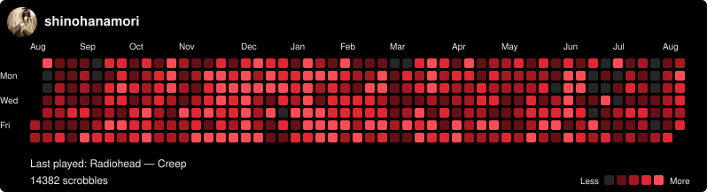
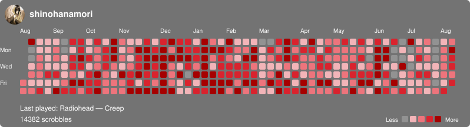
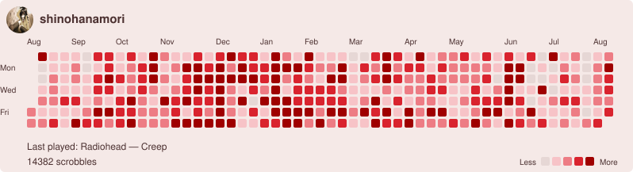
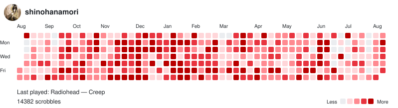
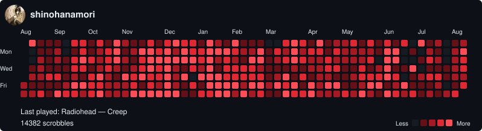

# Last.fm contribution graph

[](https://www.last.fm/user/shinohanamori)

A single-user Cloudflare Worker that turns the trailing 365 days of one Last.fm account's listening activity into a GitHub-style SVG contribution graph. A one-time local bootstrap indexes the history; afterward, a four-minute scheduled job only fetches new scrobbles. Graph requests read a lightweight daily-total cache and render quickly.

The graph includes a seven-row calendar, five red activity intensities, labels, total scrobbles, the Last.fm profile picture and username, and when the latest completed track was played. The example assets use [`shinohanamori`](https://www.last.fm/user/shinohanamori) as the sample username and contain no credentials or live private cache.

## Use the graph

After deploying the Worker, add its image URL to a profile or project README:

```md

```

The example above uses [shinohanamori's Last.fm profile](https://www.last.fm/user/shinohanamori) and the live Worker at `lastfm-contribution-graph.enzotherapper.workers.dev`. Forks should replace the hostname with their deployed Worker's hostname. The username, default theme, and timezone come from `wrangler.jsonc`.

| Argument | Required | Meaning |
| --- | --- | --- |
| `theme` | No | Overrides the configured graph theme for this rendering |
| `timezone` | No | May repeat the configured timezone; changing it requires rebuilding the cache |

For example: `/graph.svg?theme=github-dark&timezone=Asia%2FSingapore`. The Worker rejects `user` overrides because it is configured for one Last.fm account.

## Themes

All themes use red contribution cells:

| `theme` | Background | Contribution colors |
| --- | --- | --- |
| `lastfm-white` | White | Pale pink through deep Last.fm red |
| `lastfm-black` | Black | Dark red through bright red |
| `lastfm-grey` | Grey | Pale pink through deep red |
| `lastfm-organza` | Soft warm organza/rose | Pale rose through deep red |
| `github-light` | GitHub light | Pale pink through deep Last.fm red |
| `github-dark` | GitHub dark | Dark red through bright red |

### Theme previews

| Last.fm white | Last.fm black |
| --- | --- |
|  |  |

| Last.fm grey | Last.fm organza |
| --- | --- |
|  |  |

| GitHub light | GitHub dark |
| --- | --- |
|  |  |

## Deploy the Cloudflare Worker

You need a free [Cloudflare account](https://dash.cloudflare.com/sign-up), Node.js 20 or newer, and a [Last.fm API key](https://www.last.fm/api/account/create).

### 1. Install and authenticate

```sh
npm ci
npx wrangler login
```

Wrangler is pinned exactly in `package-lock.json` for reproducible deployments.

### 2. Create the private cache

```sh
npx wrangler kv namespace create LASTFM_STATE
```

Copy the returned namespace ID into [`wrangler.jsonc`](wrangler.jsonc), replacing `REPLACE_WITH_YOUR_KV_NAMESPACE_ID`.

### 3. Configure defaults

Edit the non-secret `vars` in [`wrangler.jsonc`](wrangler.jsonc):

```json
{
  "LASTFM_USERNAME": "your-lastfm-username",
  "TIMEZONE": "UTC",
  "GRAPH_THEME": "lastfm-black"
}
```

The cron trigger in `wrangler.jsonc` refreshes this configured account every four minutes.

### 4. Index your history locally

Create an untracked `.dev.vars` file containing your key:

```dotenv
LASTFM_API_KEY=your-private-key
```

Then fetch and normalize the trailing 370 days:

```sh
npm run bootstrap
```

This can take a while for a large library, but it runs on your computer and is not subject to a Worker's per-invocation subrequest ceiling. It writes the private archive and a lightweight graph record under `.wrangler/`, then prints the exact two commands needed to upload them. Run both printed commands; they look like:

```sh
npx wrangler kv key put "lastfm-user-v1:your-lastfm-username" --binding LASTFM_STATE --remote --path ".wrangler/bootstrap-state.json"
npx wrangler kv key put "lastfm-user-v1:your-lastfm-username:graph" --binding LASTFM_STATE --remote --path ".wrangler/bootstrap-graph-state.json"
```

Both bootstrap files are ignored by Git. They contain normalized public listening history or daily totals and profile data, but never the API key.

### 5. Create the Worker

```sh
npm run worker:deploy
```

The initial deployment creates the Worker but cannot fetch Last.fm until its secret is set. Add the secret immediately afterward.

### 6. Store the Last.fm key securely

```sh
npx wrangler secret put LASTFM_API_KEY
```

Enter the API key at Wrangler's prompt. It is stored as an encrypted Worker secret and must never be placed in `wrangler.jsonc`, source files, URLs, or logs.

### 7. Verify the service

Wrangler reports a hostname similar to `https://lastfm-contribution-graph.your-subdomain.workers.dev`. Check:

```text
https://lastfm-contribution-graph.your-subdomain.workers.dev/health
https://lastfm-contribution-graph.your-subdomain.workers.dev/graph.svg
```

The graph works immediately after the bootstrap state is uploaded. If the cache is missing, `/graph.svg` returns a fast `503`; image requests never start Last.fm pagination. Scheduled invocations also refuse to perform a historical backfill and log an initialization message instead.

After initialization, each scheduled run fetches only entries newer than the latest cached timestamp, with a five-minute overlap for boundary safety. This normally takes one Last.fm request and avoids the Worker subrequest-limit failure caused by attempting the initial year-long index in one invocation.

## Caching, capacity, and privacy

KV stores normalized scrobbles, profile decoration, and update metadata for the configured account. No credentials are stored in KV. Image requests only read this record; Last.fm fetching and KV writes happen in the scheduled handler.

The four-minute schedule writes the archive and lightweight graph record, for at most 720 KV writes per day, within the current [Cloudflare Workers free-plan allowance](https://developers.cloudflare.com/workers/platform/pricing/) of 1,000 KV writes per day.

The Worker URL and rendered listening activity are public. The embedded avatar is restricted to HTTPS raster images, capped at 1 MB, and refreshed at most daily. All externally sourced SVG text is XML-escaped.

The SVG uses `Cache-Control: no-cache, no-store, must-revalidate`, following [GitHub's guidance for changing externally hosted images](https://docs.github.com/en/authentication/keeping-your-account-and-data-secure/about-anonymized-urls). Image proxies may still delay a refresh.

## Local development

Create an untracked `.dev.vars` file if you have not already done so:

```dotenv
LASTFM_API_KEY=your-private-key
```

Then run:

```sh
npm ci
npm run worker:dev
```

`.dev.vars`, `.env`, `.wrangler`, temporary files, and `node_modules` are ignored by Git. Run all checks with:

```sh
npm run check
```

## Implementation notes

- Last.fm pagination, now-playing entries, transient failures, rate limits, malformed responses, and duplicates are handled by the API layer.
- Fetches use a five-minute overlap and retain 370 days for timezone boundaries.
- SVG output is deterministic for identical cache data, date, timezone, and theme.
- The Worker stores state in one KV write per user refresh.
- Public errors are generic so credentials and upstream details are not exposed.
